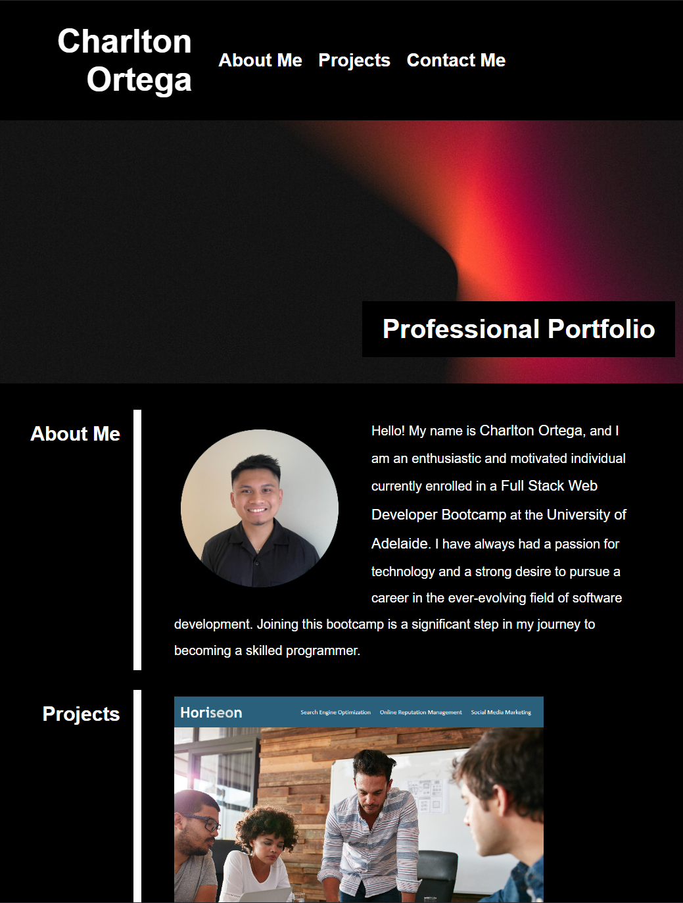

# Advanced-CSS-Professional-Portfolio

## Description
This is my personal portfolio website showcasing my skills, projects, and experiences as a web developer. Built with HTML, CSS, and JavaScript, this website serves as a platform to highlight my work and provide information about me.

## User Story

```
AS AN employer
I WANT to view a potential employee's deployed portfolio of work samples
SO THAT I can review samples of their work and assess whether they're a good candidate for an open position
```

## Acceptance Criteria

Here are the critical requirements necessary to develop a portfolio that satisfies a typical hiring manager’s needs:

```
GIVEN I need to sample a potential employee's previous work
WHEN I load their portfolio
THEN I am presented with the developer's name, a recent photo or avatar, and links to sections about them, their work, and how to contact them
WHEN I click one of the links in the navigation
THEN the UI scrolls to the corresponding section
WHEN I click on the link to the section about their work
THEN the UI scrolls to a section with titled images of the developer's applications
WHEN I am presented with the developer's first application
THEN that application's image should be larger in size than the others
WHEN I click on the images of the applications
THEN I am taken to that deployed application
WHEN I resize the page or view the site on various screens and devices
THEN I am presented with a responsive layout that adapts to my viewport
```

## Installation
To run this HTML project locally on your machine, follow these steps:

Clone the repository to your local machine using the following command:
```
git clone <repository-url>
```
If you prefer, you can also download the project as a ZIP file and extract it to your desired location.

Once you have the project files on your machine, navigate to the project's root directory.

Open the HTML file in your preferred web browser. You can do this by double-clicking the HTML file or right-clicking it and selecting "Open With" and choosing your browser.

## Group Projects
[RecipeRadar](https://jujusoi.github.io/Project-1/index.html) - is a web application that helps users find recipes based on the ingredients they have. It also provides nutritional information and allows users to save their favorite recipes for easy access in the future.

## Screenshot


The URL of the deployed application:
https://charltonortega.github.io/Advanced-CSS-Professional-Portfolio/

The URL of the GitHub repository:
https://github.com/Charltonortega/Advanced-CSS-Professional-Portfolio
